# System Patterns

## System Architecture

The Toshl MCP Server follows a layered architecture pattern to separate concerns and maintain modularity:

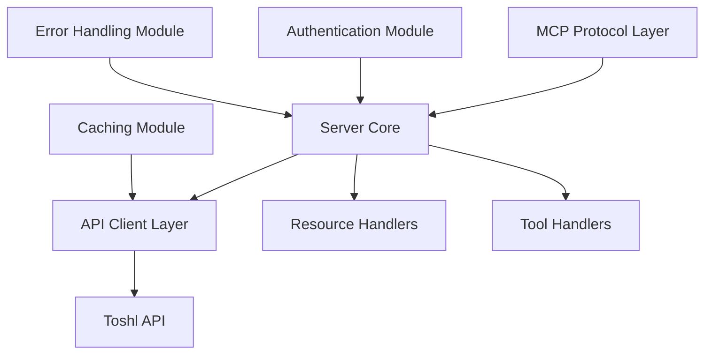

### Layers

1. **MCP Protocol Layer**: Handles communication with AI agents using the Model Context Protocol.
2. **Server Core**: Manages the core server functionality, routing, and request handling.
3. **API Client Layer**: Communicates with the Toshl API, handling authentication, requests, and responses.
4. **Resource Handlers**: Exposes Toshl data as MCP resources.
5. **Tool Handlers**: Implements MCP tools for data retrieval and analysis.
6. **Support Modules**: Authentication, caching, and error handling modules that support the main layers.

## Design Patterns

### 1. Adapter Pattern

Used to adapt the Toshl API responses to the MCP resource and tool formats. This pattern helps in translating between different interfaces.

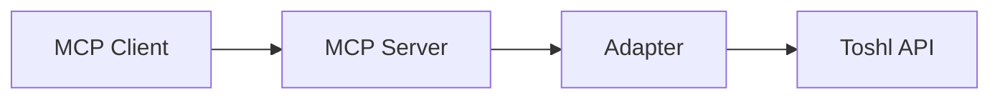

### 2. Repository Pattern

Used for data access abstraction. Each Toshl API endpoint has a corresponding repository that handles data retrieval and caching.

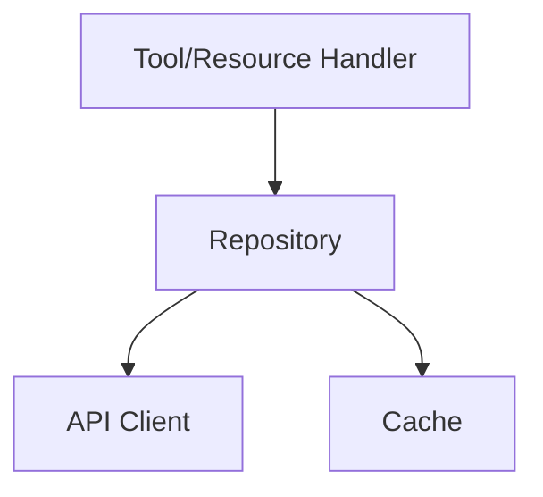

### 3. Factory Pattern

Used to create API clients and handlers based on configuration.

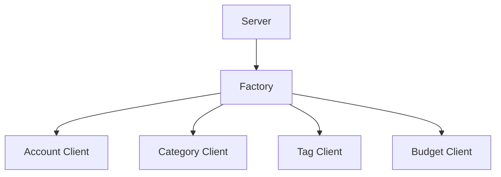

### 4. Strategy Pattern

Used for authentication to support different authentication methods (Basic Auth, OAuth).

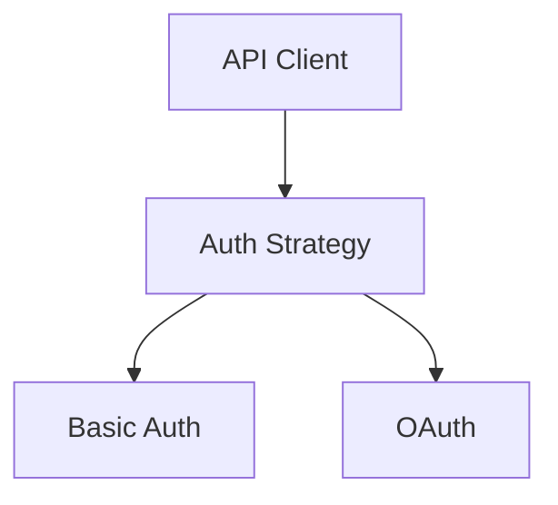

### 5. Decorator Pattern

Used for adding caching and logging capabilities to API clients.

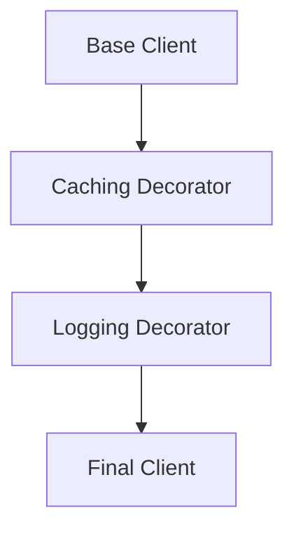

## Component Relationships

### MCP Server and Handlers

The MCP Server is the central component that initializes and coordinates all other components. It registers resource and tool handlers and manages the lifecycle of the server.

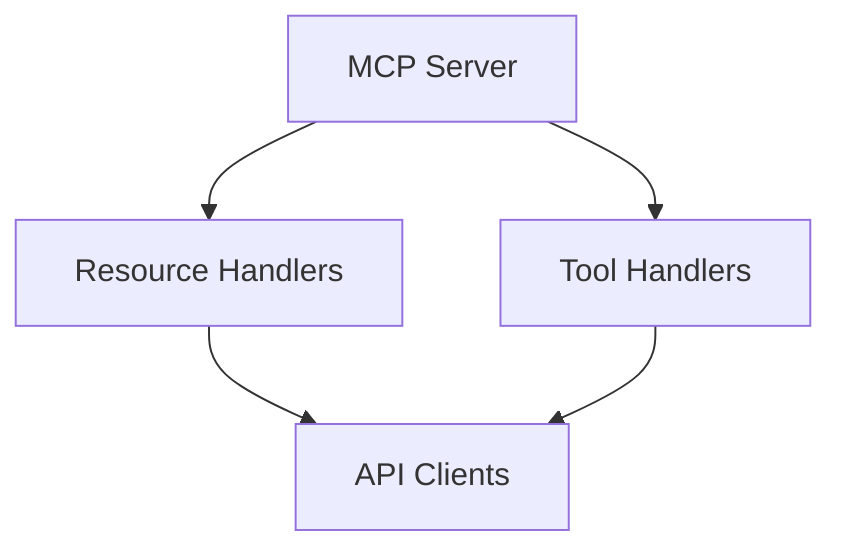

### API Clients and Repositories

API Clients communicate with the Toshl API, while Repositories provide a higher-level abstraction for data access.

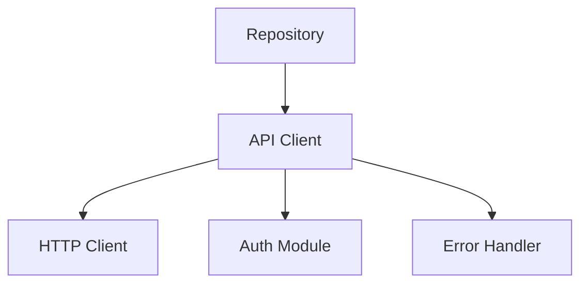

### Caching Strategy

The caching system uses ETags and time-based expiration to optimize API usage.

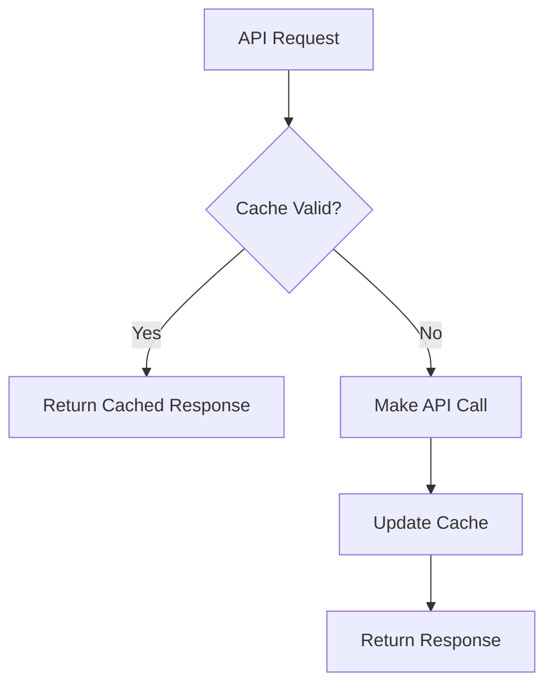

## Error Handling

The error handling system maps Toshl API errors to appropriate MCP errors and provides meaningful error messages.

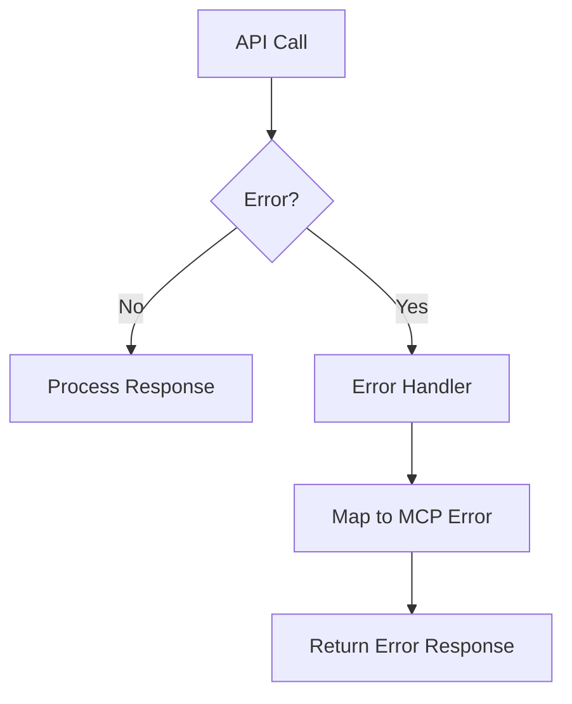

## Data Flow

The typical data flow for a request:

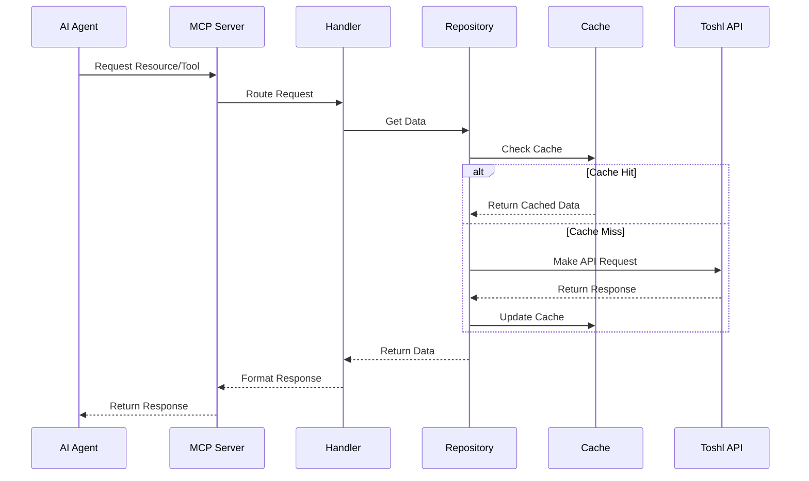

## Technical Decisions

1. **TypeScript**: Used for type safety and better developer experience.
2. **MCP SDK**: Used for implementing the MCP server.
3. **Axios**: Used for HTTP requests to the Toshl API.
4. **Node-Cache**: Used for in-memory caching.
5. **Winston**: Used for logging.
